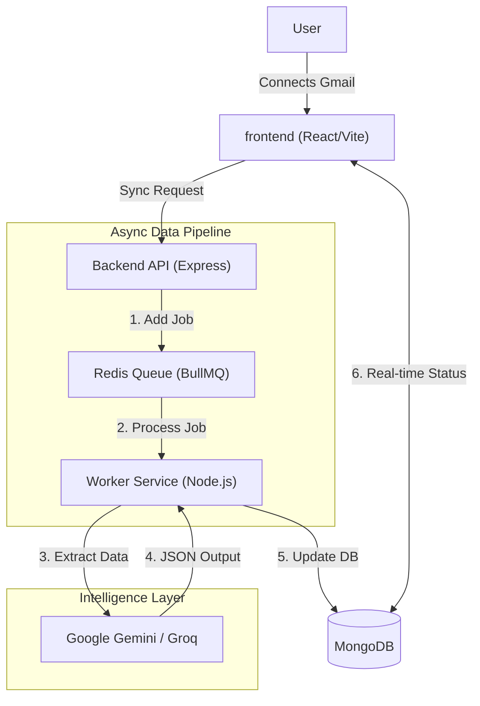
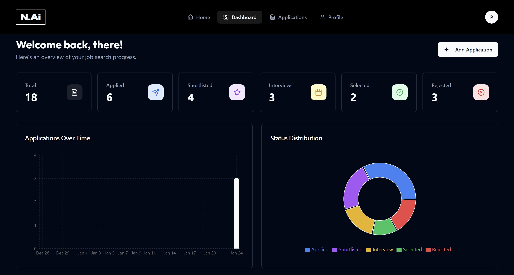
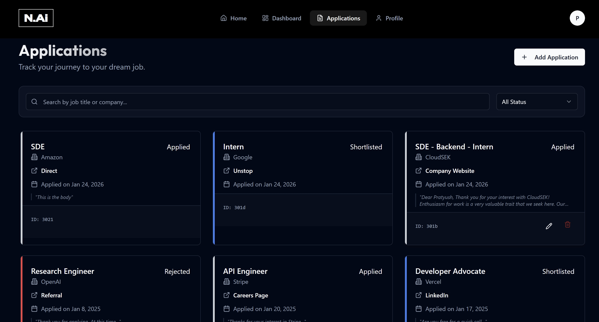
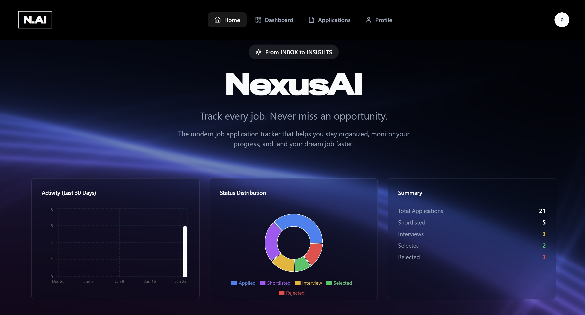

# NexusAI 🚀
### From Inbox to Insights: The AI-Powered Career Assistant

[](https://react.dev/)
[](https://nodejs.org/)
[](https://docs.bullmq.io/)
[](https://deepmind.google/technologies/gemini/)

NexusAI is not just a CRUD app—it's an intelligent **Application Tracking System (ATS)** for candidates. It automatically syncs with your Gmail, monitors job application emails, extracts key details (Company, Role, Status) using **LLMs**, and visualizes your progress on a real-time dashboard.

Stop manually updating spreadsheets. Let the AI do the work.

---

## 🏗️ System Architecture

NexusAI uses an **Event-Driven Architecture** to ensure the User Interface remains snappy while heavy AI processing happens in the background.



### Key Design Decisions
1.  **Asynchronous Processing**: Email parsing and LLM inference take 2-5 seconds per email. We use **BullMQ (Redis)** to offload this to a background worker, preventing request timeouts.
2.  **Hybrid Classification**: We use a combination of RegEx (for speed) and LLMs (Google Gemini/Groq) for accuracy when detecting "Interview Invites" vs "Rejections".
3.  **JSON-Native**: The entire pipeline (Gmail API -> LLM -> MongoDB -> React) handles complex nested JSON data without rigid SQL schema migrations.

---

## 🌟 Key Features

*   **🔄 One-Click Gmail Sync**: Authenticate with Google and instantly pull all job-related emails.
*   **🧠 AI Extraction**: Automatically detects Company Name, Job Role, and Application Status (Applied/Rejected/Interview).
*   **📊 Insights Dashboard**: Visualize your acceptance rates, daily application volume, and pipeline health with Recharts.
*   **⚡ Real-Time**: Status updates reflect immediately as the worker processes the queue.
*   **🎨 Modern UI**: Built with **Shadcn UI** + **Tailwind CSS** for a premium, accessible experience.

---

## 🛠️ Tech Stack

### Frontend
*   **Framework**: React 18 + Vite (TypeScript)
*   **Styling**: TailwindCSS + Shadcn UI
*   **State Management**: TanStack Query (React Query)
*   **Visuals**: Recharts, Framer Motion, Lucide Icons

### Backend
*   **Runtime**: Node.js + Express
*   **Database**: MongoDB (Mongoose)
*   **Queue System**: BullMQ + Redis
*   **AI/LLM**: Google Generative AI (Gemini 1.5 Flash), Groq SDK

---

## 🚀 Getting Started

### Prerequisites
*   Node.js v18+
*   Redis (for the queue)
*   MongoDB Instance
*   Google Cloud Console Project (for Gmail API)

### 1. Clone & Install
```bash
git clone https://github.com/Pratyush426/nexusai.git
cd nexusai
```

### 2. Backend Setup
```bash
cd server
npm install
# Create .env file with:
# MONGO_URI, REDIS_URL, GOOGLE_CLIENT_ID, GEMINI_API_KEY
npm run dev
```

### 3. Frontend Setup
```bash
cd client
npm install
npm run dev
```

---

## 🔮 Future Roadmap
- [ ] **Resume Parsing**: Auto-tailor resumes based on job descriptions.
- [ ] **Browser Extension**: One-click "Apply & Track" from LinkedIn/Indeed.
- [ ] **Interview Prep**: AI-generated mock interview questions based on the specific job role.

---

## 📝 License
MIT License. Built with ❤️ by Pratyush.

---

## 📸 Application Previews

<div align="center">
  
  
  
</div>
